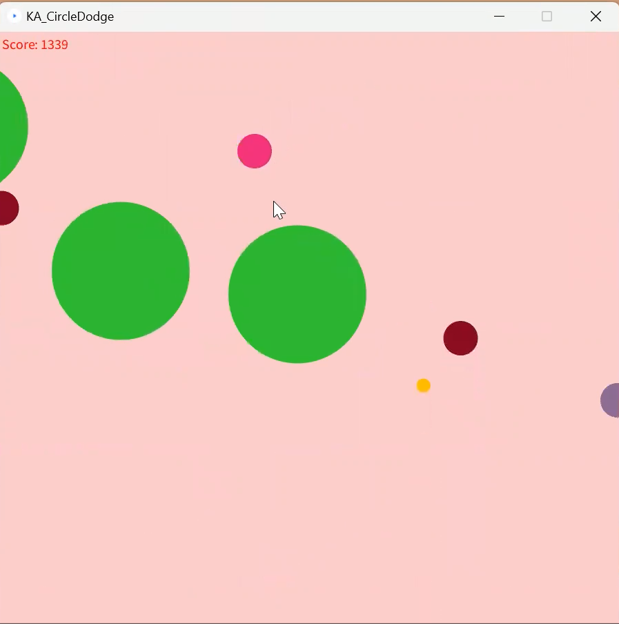

# Circle Dodge

## 🌀 Overview

Circle Dodge is a fast-paced, reflex-based game where your goal is to survive as long as possible by dodging incoming enemy circles. Simple in design but challenging in execution, the game tests your reaction time and strategic movement.

This project was inspired by an academic exercise and re-imagined as a fun, lightweight game built using Processing.

## 🕹️ How to Play

    Move your player circle using the arrow keys:

        ← → to move left and right

        ↑ ↓ to move up and down

    Avoid the red enemy circles—colliding with one ends the game.

    Survive as long as you can. The longer you last, the faster the enemies get, the more they grow in numbers. - 
    
**Can You beat my high score?**

## 🚀 Getting Started
#### Requirements
- Processing (version 4.0 or higher recommended)

#### Installation
- Download or clone this repository:
    git clone https://github.com/yourusername/circle-dodge-game.git
    cd circle-dodge-game

- Open the CircleDodge.pde file in the Processing IDE.

- Run the sketch by clicking the Play button.

## 📝 Credits

* **Taisann Kham** – Original Developer
* **Circle Dodge Project** – GGC ITEC2140

---

## 📢 License

MIT License – You’re free to build, remix, and dodge your way to glory.

